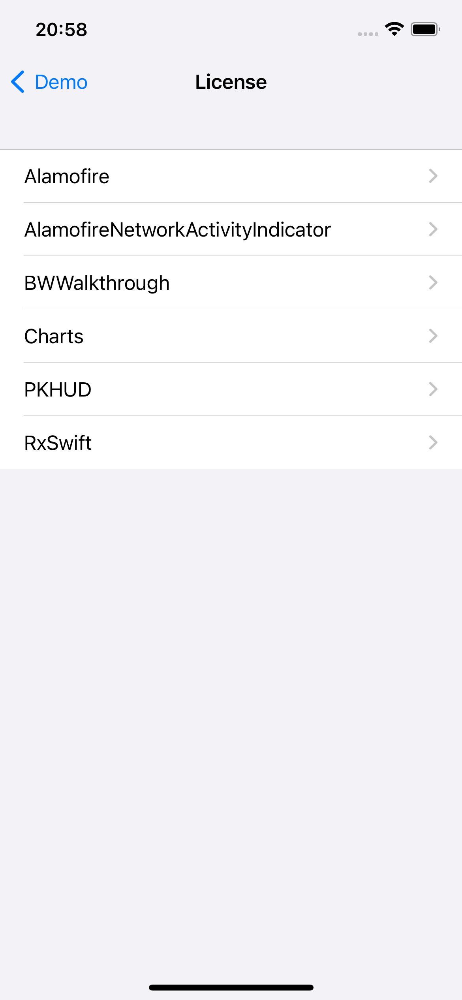
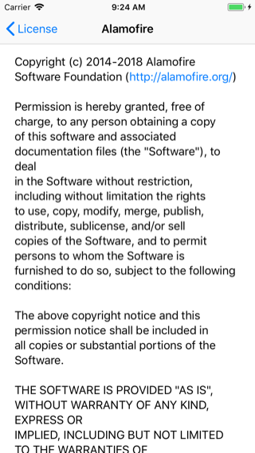
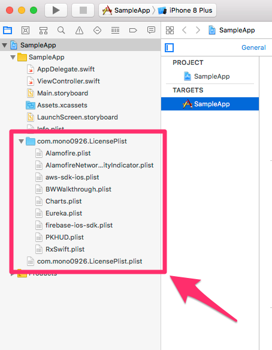

LicensePlistViewController
==


[](LICENSE)
[](https://developer.apple.com/swift)
[](http://cocoadocs.org/docsets/LicensePlistViewController)
[](https://github.com/hsylife/SwiftyPickerPopover)

LicensePlistViewController is ViewController for [LicensePlist](https://github.com/mono0926/LicensePlist/).




## Requirements

* Swift 5.0
* iOS 9.0 or later

If you use Swift 4.0, try to use 1.1.2

## Installation

### CocoaPods

Simply add the following line to your `Podfile`:

```
pod 'LicensePlistViewController'
```

### Cartage

Simply add the following line to your `Cartfile`:

```
github "yhirano/LicensePlistViewController"
```

## Usage

### Install LicensePlist

[Install LicensePlist](https://github.com/mono0926/LicensePlist/#installation).

Example Homebrew:

```
brew install mono0926/license-plist/license-plist
```

### Use license-plist

[Use license-plist](https://github.com/mono0926/LicensePlist/#usage).

Example command:

On the directory same as `Cartfile` or `Pods`, simply execute `license-plist`.

```
license-plist
```

`com.mono0926.LicensePlist.Output` directory will be generated.

### Add refecense

Add reference `com.mono0926.LicensePlist.plist` file and `com.mono0926.LicensePlist` directory to source tree.



### Call LicensePlistViewController

```swift
let viewController = LicensePlistViewController()
self.navigationController?.pushViewController(viewController, animated: true)
```

## References

* [LicensePlist](https://github.com/mono0926/LicensePlist/)
* [AcknowList](https://github.com/vtourraine/AcknowList)
